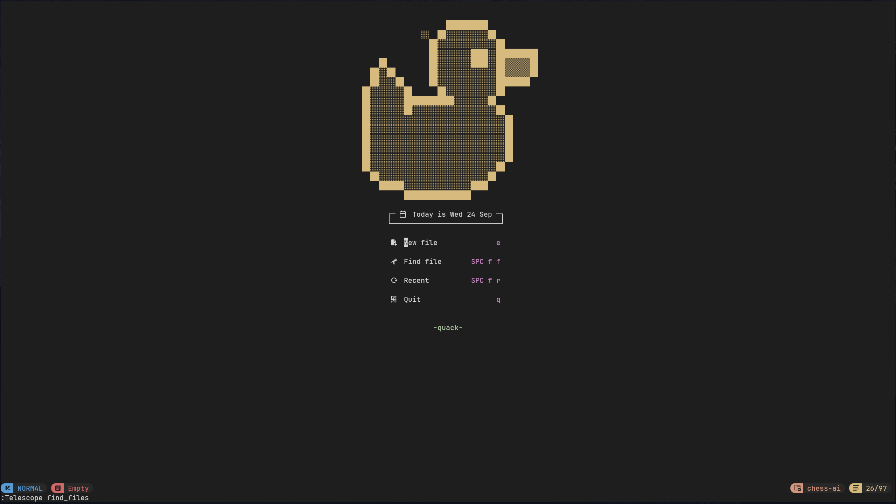
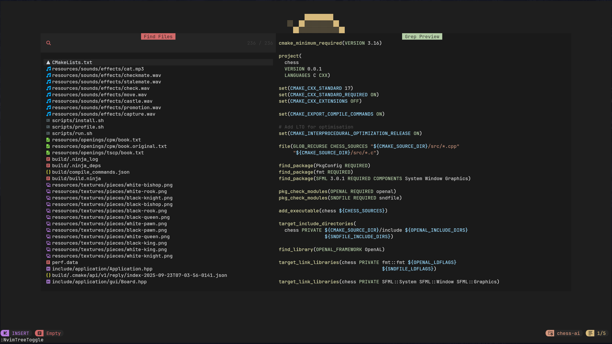
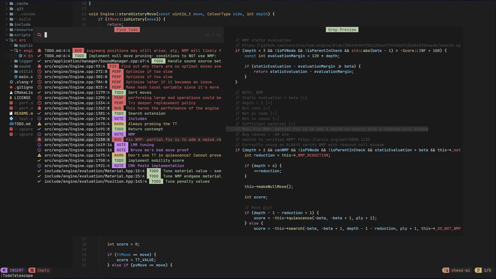
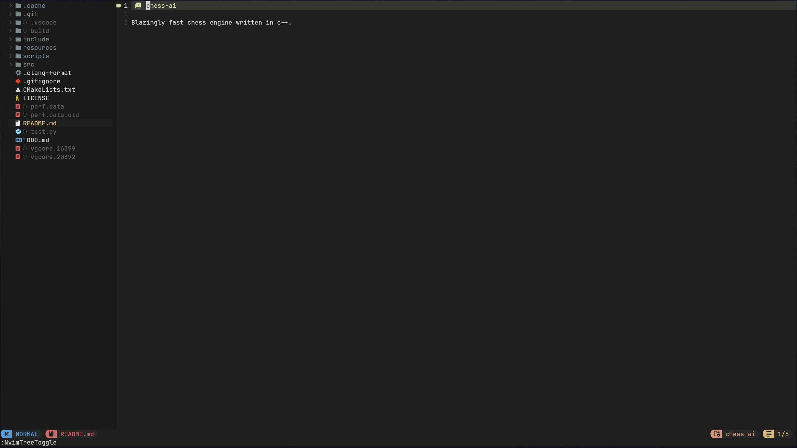
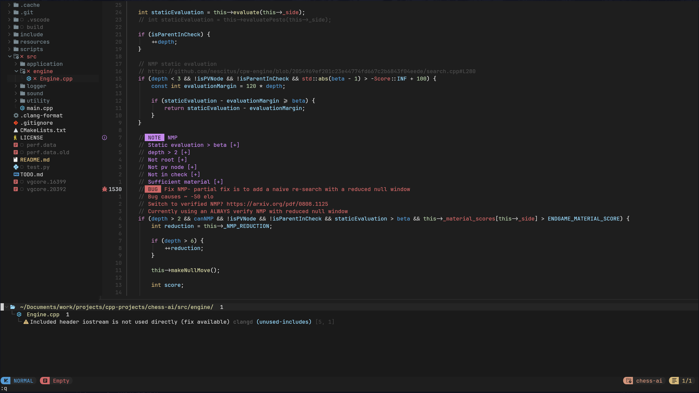
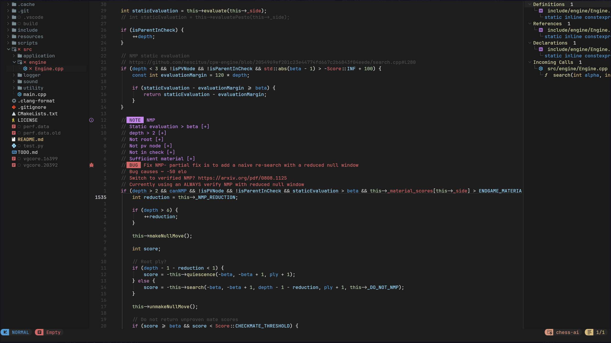
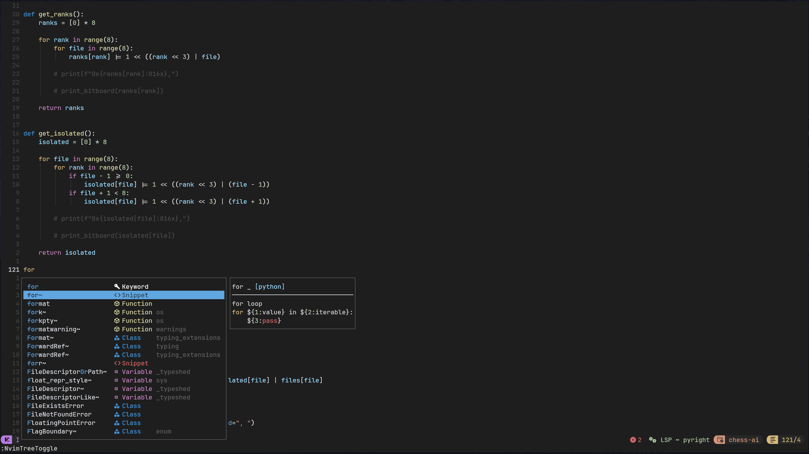
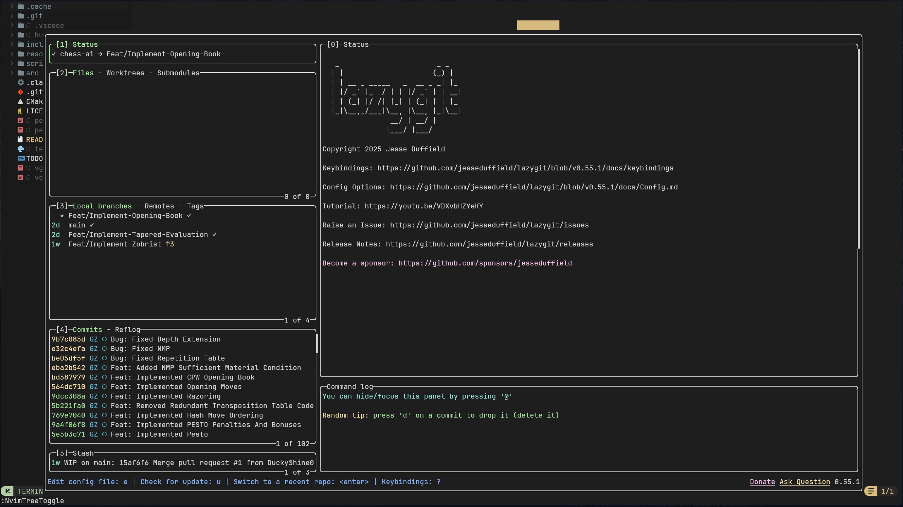
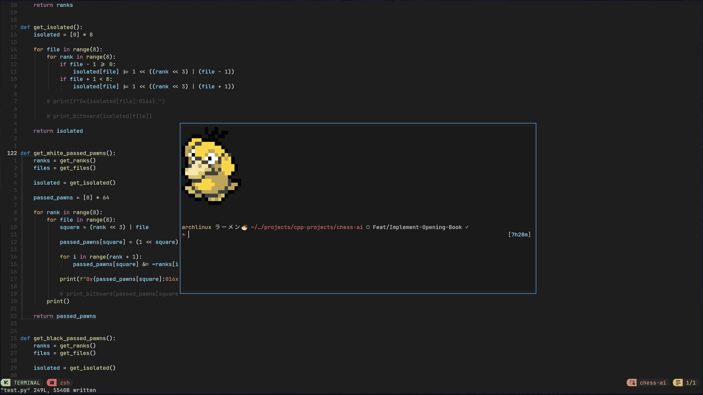
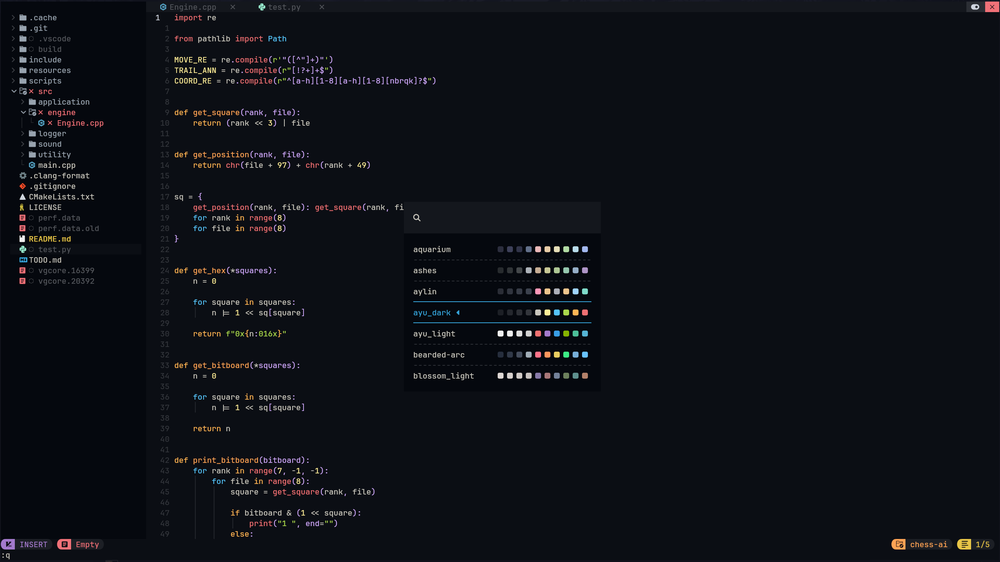

# NeoDuck
NeoDuck :duck: is my personal Neovim configuration, built on top of [NvChad's](https://nvchad.com/) base configuration.

## Table of Contents
- [Getting Started](#getting-started)
  - [Requirements](#requirements)
  - [Installation](#installation)
  - [Post Installation](#post-installation)
- [Plugins and Screenshots](#plugins-and-screenshots)
  - [Dashboard](#dashboard)
  - [Telescope](#telescope)
  - [Todo](#todo)
  - [Markdown](#markdown)
  - [Trouble](#trouble)
  - [LSP and Auto Completion](#lsp-and-auto-completion)
  - [Lazygit](#lazygit)
- [Miscellaneous Plugins](#miscellaneous-plugins)
  - [Terminal](#terminal)
  - [Theme Picker](#theme-picker)
- [Credits](#credits)

## Getting Started
This section will guide you through installing NeoDuck.

### Requirements
* [Neovim 0.11](https://neovim.io/news/2025/03]) or the latest nightly build is required for the plugins to work. 
* Please also check the pre-requisites listed in NvChad's [installation guide](https://nvchad.com/docs/quickstart/install]).

### Installation
After you have met the requirements, proceed to follow the installation steps for the listed operating systems:

<details>

<summary>Linux/MacOS</summary>

Clone the repository with the following command:
```sh
git clone https://github.com/DuckyShine004/neo-duck ~/.config/nvim
```

</details>

<details>

<summary>Windows</summary>

Clone the repository with the following command:
```sh
git clone https://github.com/DuckyShine004/neo-duck ~/.config/nvim
```

</details>

<br>

After cloning the repository:
1) Open Neovim in your terminal with:
```sh
nvim
```

2) Inside Neovim, run:
```sh
:MasonInstallAll
```

To install all language servers, formatters, linters, etc.,

### Post Installation
To verify that everything is set up correctly, run the following command in Neovim:
```sh
:checkhealth
```

> [!NOTE]
> If you want to build on top of my configuration, delete the `.git` directory, so your changes won't conflict with future updates. However, if you'd like to stay up-to-date with my changes, keep it.

## Plugins and Screenshots
These are the additional plugins I use on top of NvChad's defaults:
* [alpha.nvim](https://github.com/goolord/alpha-nvim)
* [telescope.nvim](https://github.com/nvim-telescope/telescope.nvim)
* [todo-comments.nvim](https://github.com/folke/todo-comments.nvim)
* [markview.nvim](https://github.com/OXY2DEV/markview.nvim)
* [markdown-preview.nvim](https://github.com/iamcco/markdown-preview.nvim)
* [trouble.nvim](https://github.com/folke/trouble.nvim)
* [lazygit.nvim](https://github.com/kdheepak/lazygit.nvim)

### Dashboard
Custom dashboard using [alpha.nvim](https://github.com/goolord/alpha-nvim).
<div align="center">



</div>

### Telescope
Quickly find files and navigate projects using [telescope.nvim](https://github.com/nvim-telescope/telescope.nvim)

<div align="center">



</div>

### Todo
Highlight and track `TODO` comments across your codebase [todo-comments.nvim](https://github.com/folke/todo-comments.nvim)

<div align="center">



</div>

### Markdown
Live markdown preview using [markdown-preview.nvim](https://github.com/iamcco/markdown-preview.nvim) and in-buffer preview using [markview.nvim](https://github.com/OXY2DEV/markview.nvim)

<div align="center">



</div>

### Trouble
Browse diagnostics, references, symbols, etc., using [trouble.nvim](https://github.com/folke/trouble.nvim)

<div align="center">




</div>

### LSP and Auto Completion
Language servers are configured using [nvim-lspconfig](https://github.com/neovim/nvim-lspconfig) and code completions using [nvim-cmp](https://github.com/hrsh7th/nvim-cmp)

<div align="center">



</div>

### Lazygit
Lazygit within Neovim using [lazygit.nvim](https://github.com/kdheepak/lazygit.nvim)

<div align="center">



</div>

## Miscellaneous Plugins
Here are some other cool plugins!

### Terminal
Integrated terminal inside Neovim.

<div align="center">



</div>

### Theme Picker
Switch between themes!

<div align="center">



</div>

## Credits
* [NvChad](https://github.com/NvChad/NvChad) for the amazing base configuration!

